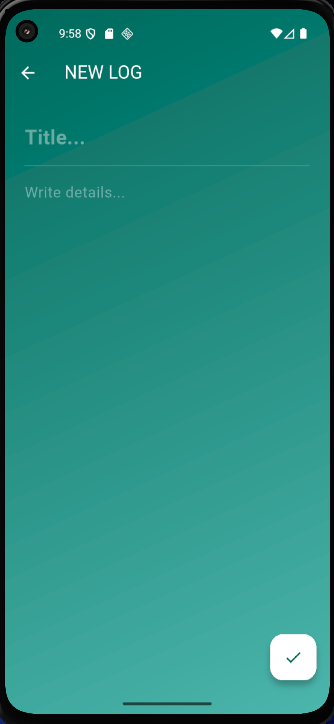
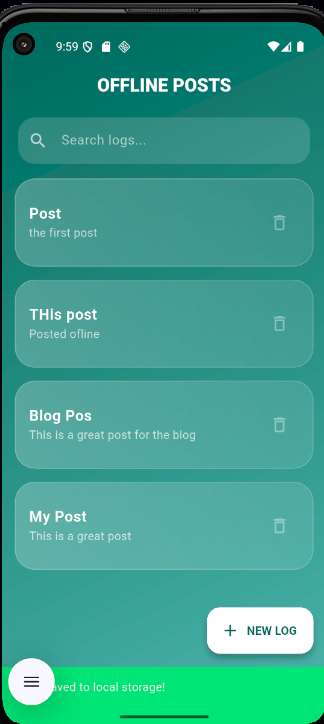
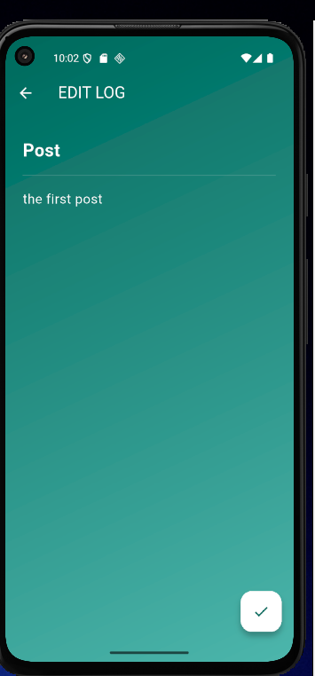
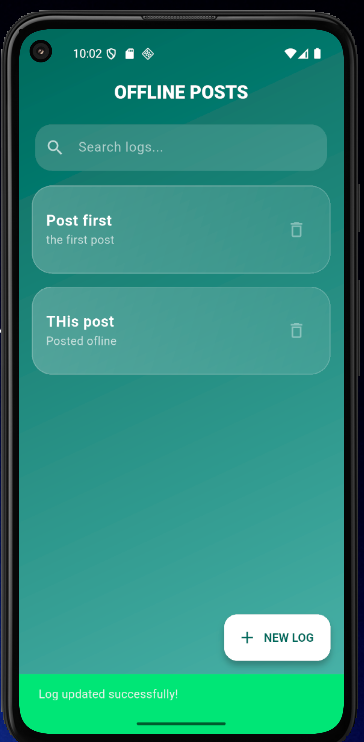
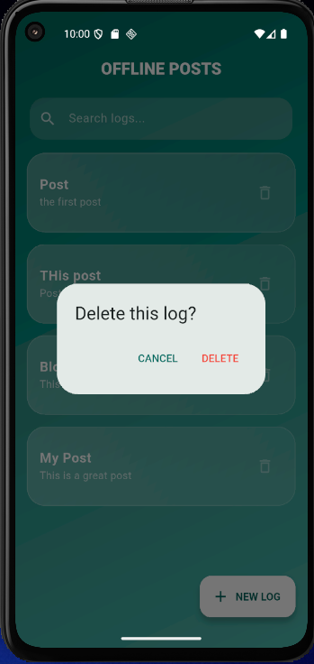
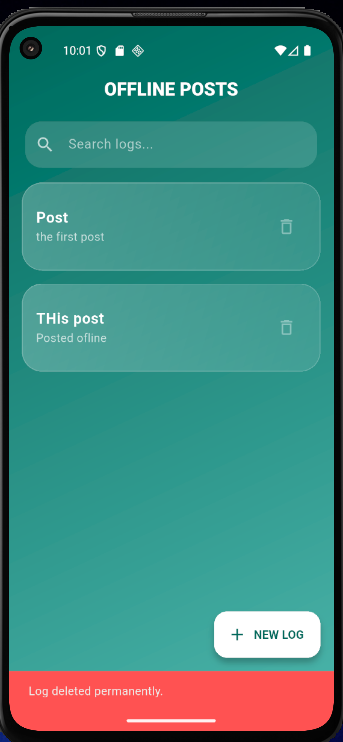
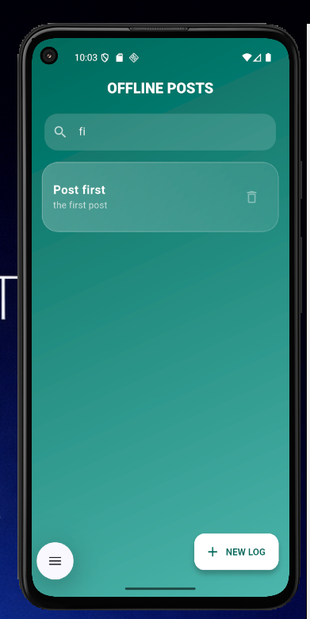
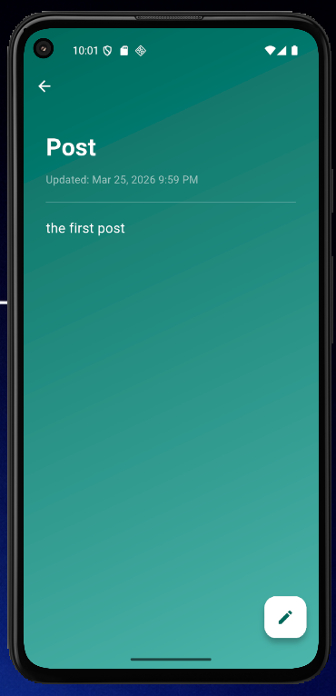

# Offline Posts Manager — Emerald Edition

> A production-grade Flutter app for managing posts locally using SQLite , built for teams who need to work without internet connectivity.

---

## Overview

This app enables full offline CRUD operations on posts stored locally via SQLite, demonstrating:

- Local database integration with `sqflite`
- Clean Architecture & MVVM pattern
- Reactive state management with `provider`
- Modern Material 3 UI with emerald theming

---

##  Key Features & CRUD Operations

The app provides a seamless interface for managing posts locally with immediate visual confirmation for every action.

### 1. View All Posts (Read)
- **Glassmorphic List:** A frosted-glass list displaying all locally stored posts.
- **Live Search/Filtering:** Instant results as you type — no button press required.

### 2. Add New Post (Create)
- **Input Validation:** Ensures no empty posts are created before inserting.
- **Success Feedback:** Green snackbar confirmation after successful DB insertion.

### 3.  Detail View (Read — Single Record)
- **Immersive View:** A dedicated full-screen to read the complete post content.

### 4.  Edit Existing Post (Update)
- **Pre-filled Forms:** Editing screen opens with existing content already loaded.
- **Update Confirmation:** Green snackbar confirms the record was updated in SQLite.

### 5.  Delete Post (Delete)
- **Safety Dialog:** Confirmation prompt prevents accidental deletion.
- **Status Feedback:** Alert snackbar confirms the record has been removed from the database.

---

## Visual Proof of Functionality

| Action | Interface | Success Feedback |
|---|---|---|
| **Add Post** |  |  |
| **Edit Post** |  |  |
| **Delete Post** |  |  |
| **Search** |  | *Real-time results* |
| **Detail View** |  | *Full-screen reading* |

---

##  Technical Architecture

###  Data Layer — SQLite
Uses `sqflite` with a **Singleton Pattern** to manage a local database (`posts.db`).

- **Auto-Timestamps:** Every post automatically tracks `createdAt` and `updatedAt` fields.
- **Async I/O:** All DB operations are `async/await` to prevent UI thread freezing.
- **Database Initialization Guard:** Throws a clear error if the DB is accessed before `initDB()` completes.

### Logic Layer — MVVM with Provider
Powered by the **Provider** package. The UI never communicates directly with the database — it only observes `PostProvider`.

- `PostProvider` exposes: `posts`, `isLoading`, `error` observables.
- All mutations (`add`, `update`, `delete`) trigger `notifyListeners()` for reactive UI rebuilds.
- Error states are caught and surfaced via the provider, not silently swallowed.

### UI Layer — Material 3
- **Emerald Gradient Theme:** Custom color scheme using `#00695C` → `#4DB6AC`.
- **Flutter 3.27+ Compliant:** Uses `withValues` instead of deprecated `withOpacity`.
- **Responsive Layout:** Adapts to any mobile screen size without overflow.

---

##  Dependencies

```yaml
dependencies:
  flutter:
    sdk: flutter
  sqflite: ^2.3.0        # Local SQLite database — offline-first storage
  provider: ^6.1.1       # Reactive state management (MVVM)
  intl: ^0.19.0          # Date/time formatting for timestamps
  path: ^1.9.0           # Cross-platform DB file path resolution
```

### Why These Dependencies?

| Package | Purpose |
|---|---|
| `sqflite` | Native SQLite wrapper for Flutter — stores relational data persistently on device without internet |
| `provider` | Lightweight, Google-recommended state management — separates UI from business logic |
| `intl` | Formats `createdAt`/`updatedAt` timestamps for human-readable display |
| `path` | Resolves the correct OS-level file path for the `.db` file on Android & iOS |

**Why SQLite specifically?**
SQLite is embedded directly into the device — no server, no network required. It supports full SQL queries, ACID transactions, and persists data between app restarts. It is the standard choice for structured local data in mobile apps.

---

##  How to Run

```bash
# 1. Verify Flutter installation
flutter --version

# 2. Install dependencies
flutter pub get

# 3. Connect a device or start an emulator, then run
flutter run
```

---

##  Error Handling Strategy

| Scenario | Handling Approach |
|---|---|
| Database not initialized | Guard clause in `DatabaseHelper` throws `StateError` with a clear message |
| Insert / update / delete failure | `try/catch` in provider; sets `error` state; snackbar displays failure message |
| Invalid or empty input | Form validators run before any DB call is made |
| Corrupted / null data | Null-safe model parsing; `fromMap` returns safe defaults |

---

## SQLite Concepts

### Database vs Table
A **database** (`posts.db`) is the file that holds all data. A **table** (`posts`) is a structured grid inside that database — rows are records, columns are fields (e.g., `id`, `title`, `body`, `createdAt`).

### CRUD in SQLite
| Operation | SQL Method | sqflite Call |
|---|---|---|
| Create | `INSERT INTO posts ...` | `db.insert('posts', map)` |
| Read | `SELECT * FROM posts` | `db.query('posts')` |
| Update | `UPDATE posts SET ... WHERE id=?` | `db.update(...)` |
| Delete | `DELETE FROM posts WHERE id=?` | `db.delete(...)` |

### Async Flutter ↔ SQLite
Flutter runs on the UI thread. SQLite I/O is disk-based and slow. Every `sqflite` call returns a `Future<T>`, ensuring disk reads/writes happen on a background isolate — keeping the UI at 60 fps.

---

## Project Structure

```
lib/
├── main.dart
├── models/
│   └── post.dart            # Post data model with fromMap/toMap
├── database/
│   └── database_helper.dart # Singleton DB manager, CRUD methods
├── providers/
│   └── post_provider.dart   # ChangeNotifier — state & DB bridge
└── screens/
    ├── home_screen.dart      # List + search
    ├── add_screen.dart       # Create form
    ├── edit_screen.dart      # Update form
    └── detail_screen.dart    # Full post view
```

---

## Developed By

**Aline NIYONIZERA**
** 223009117**
